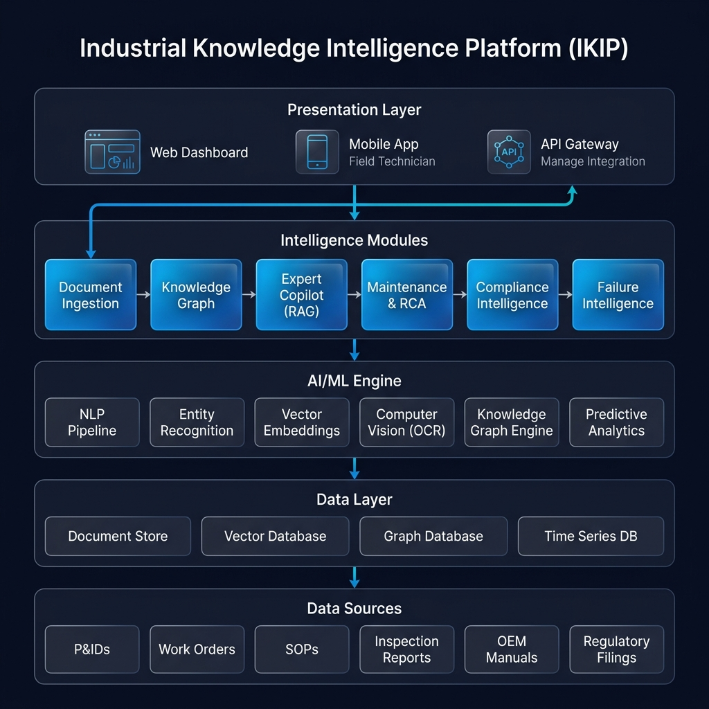

# Industrial Knowledge Intelligence Platform (IKIP) — System Architecture

IKIP is structured as a light, high-performance three-tier application designed to turn raw, unstructured refinery documents into queryable, networked intelligence.

---

## 1. System Architecture Diagram

---

## 2. System Components & Data Flow

The platform separates document processing, semantic API endpoints, and user visualization into three decoupled layers:

### A. Data Ingestion & Storage Layer (The Corpus)
- **Directory:** [documents-raw/](../documents-raw)
- **Role:** Houses the raw, markdown-formatted technical documents, standard operating procedures (SOPs), maintenance logs, hazard assessments (HIRA), and regulatory standards (OISD, CPCB, PESO, DGFASLI).
- **Live Ingestion:** When a user uploads a document through the frontend dashboard, the file is read as text via the `FileReader` API and POSTed to `/api/upload`. The server writes it directly to the `documents-raw/` folder, dynamically growing the refinery's corpus.

### B. Parser & Express Server Layer (Processing & RAG API)
- **Directory:** [server/](../server), [server.js](../server.js)
- **Key Modules:**
  1. **Dynamic Entity Extractor ([server/parser.js](../server/parser.js)):** Uses generic regular expressions and semantic heuristics to scan raw document text. It extracts equipment tags, key operational parameters, regulations, and personnel. Relationships are established via spatial proximity rules (e.g., if an equipment code is mentioned within 3 lines of an OISD standard or a maintenance technician, a link is drawn).
  2. **Knowledge Graph API (`GET /api/graph`):** Scans all files in `documents-raw/` dynamically, parses each file using the extractor, and merges common nodes and links across all documents into a unified network layout.
  3. **Copilot Chat API (`POST /api/chat`):** Implements a computed Retrieval-Augmented Generation (RAG) search engine. It tokenizes user queries, screens out stopwords, and measures keyword overlap against all files in the corpus. The most relevant documents are retrieved and passed to the **Gemini 2.0 Flash** model as a system context prompt. Source citations and confidence percentages are computed dynamically based on the degree of term overlap.

### C. Single-Page Application Layer (Visualization Frontend)
- **Directory:** [src/](../src)
- **Key Modules:**
  1. **Knowledge Graph Module ([src/pages/knowledge-graph.js](../src/pages/knowledge-graph.js)):** Connects to `/api/graph` and renders a live, interactive D3.js force-directed graph. Users can drag nodes, click nodes to view adjacent relationships, and watch the graph adjust dynamically when new files are uploaded.
  2. **Expert Copilot Chat Module ([src/pages/copilot.js](../src/pages/copilot.js)):** Connects to `/api/chat` to provide conversational Q&A, displaying live citations, confidence metrics, and interactive follow-up questions.
  3. **Analytics & Performance Modules:** Renders statutory compliance status lists, maintenance root-cause analysis (RCA) trees, and failure timeline charts using standard web components.
